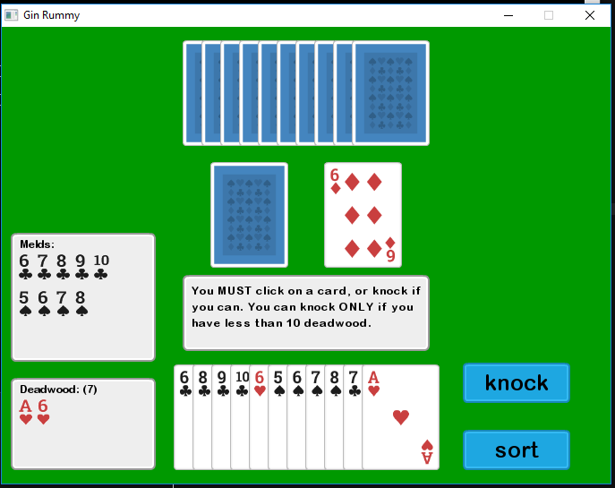
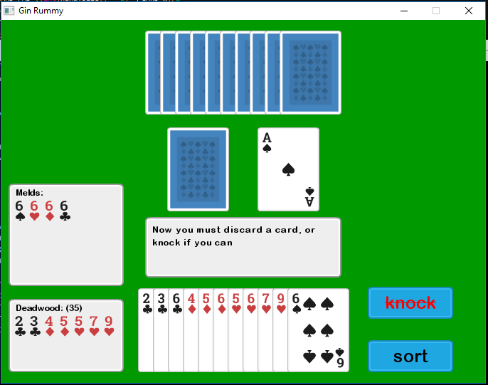

  

# Gin Rummy #
A graphical game of Gin Rummy. This game was created for our ECGR 2104 class as
our Final Project. 

### Rules ###
* https://cardgames.io/ginrummy/#rules

### Strategy ###
* https://www.gamecolony.com/gin_rummy_game_strategy.shtml
* http://ginrummy.com/strategy.html

### Screenshots

  
  

### Details ###
The goal of the project is to develop a game where the computer (that is your 
program) plays Gin rummy against a human opponent. The rules of Gin rummy are 
described in the Wikipedia page https://en.wikipedia.org/wiki/Gin_rummy You can
implement any version of the game, although you are strongly encouraged to 
initially work on simpler versions of the game first.  

The project is done in groups of 3. The project consists of the following milestones:
1. (Get familiar): Play the game manually to get a feel of the game. Remember,
	that unless you know how to play the game yourself, you cannot write a
	program that allows the computer to play the game! 
2. (Design): Figure out the following that you will need - 1) Classes 2)
	Data Structures 3) Algorithms. As an example, you could have a "Card" class
	to represent different suites and ranks; data structures to hold stock pile,
	discard pile, and player hands; and algorithms to identify melds, and deadwood. 	
3. Implement and test each of the classes individually. Note: All your code
	should be organized as separate files - that is, class declarations in 
	headers, and definitions in implementation files.
4. Integrate all components and test the final game. 
5. Ask a friend (outside your group), to play against the computer. 

Note: You may have to iterate over the milestones. For example, if the
integration causes issues, it's possible you may need to revisit Milestone 2.

#### Project management: ####
You are strongly encouraged to use a version control system in the project.
Version control systems are a category of software tools that help a software
team manage changes to source code over time. Version control software keeps
track of every modification to the code in a special kind of database. If a
mistake is made, developers can turn back the clock and compare earlier versions
of the code to help fix the mistake while minimizing disruption to all team members.  

Here are useful links on how to use the widely used Github platform:

#### To get started on Github: ####
* https://guides.github.com/activities/hello-world/

#### To get your project on Github: ####
* https://guides.github.com/introduction/getting-your-project-on-github/

If you are using an IDE (Codeblocks, Netbeans etc.) use the Project features of
your IDE to organize your code.  

If you are using command line (Linux, Mac), use the make utility for project
management. Here's a tutorial for make 
http://www.math.tau.ac.il/~danha/courses/software1/make-intro.html

**Project Evaluation:**
The project evaluation will be done through an oral exam by the Professor or TA.
You will upload all your project as a .zip file on Canvas ahead of the oral exam.
The signup sheets for the oral exam will be posted later. 

## Prerequisites ##
You do **NOT** need have SDL libs installed. I put them in the repository for
ease of use. Also you must be on a Windows OS, because all the DLLs are Window's
based.

## Installation ##
Please use `<make> ./bin/make.exe` to compile the program when debugging.  
You can also use `<make> install` to compile the final (optimized) program.

## Usage ##
See Installation. If you used `<make> ./bin/make.exe` to compile, the program is
in the `bin` directory. If you used `<make> install`, then the game should automatically
run. If you want to play again, run the `Play_GinRummy.exe` in the root folder

## Built with ##
#### SDL 2.0 ####
https://www.libsdl.org/  
https://www.libsdl.org/download-2.0.php

#### SDL_Image ####
https://www.libsdl.org/projects/SDL_image/

## Contributing ##
1. Fork it!
2. Create your feature branch: `git checkout -b my-new-feature`
3. Commit your changes: `git commit -am 'Add some feature'`
4. Push to the branch: `git push origin my-new-feature`
5. Submit a pull request :D

## Authors ##
* **Aryan Gupta**
* **Pichsapa Kulapruk**
* **Harrison Read**

## Big Thanks to ##
* https://kenney.nl/ - Assets

## License ##
Because this software was created on UNCC campus, UNCC owns us. We are not sure
of the details, but please visit http://legal.uncc.edu/ and
http://legal.uncc.edu/policies/up-301 for more info. 

